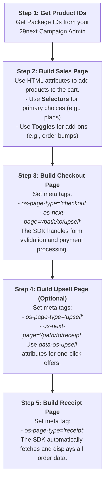

# Core Concepts | [Overview →](overview.md)

Understanding these core concepts will help you make the most of Campaign Cart.

## Packages vs Profiles

Campaign Cart supports two ways to reference products:

### Packages (Legacy)
- Numeric IDs (e.g., `1`, `2`, `3`)
- Direct mapping to campaign packages
- Simple but less flexible

```html
<button data-os-action="toggle-item" data-os-package="1">Add Package #1</button>
```

### Product Profiles (Recommended)
- Semantic IDs (e.g., `starter-kit`, `pro-bundle`)
- Country-aware automatic mapping
- Metadata support (categories, tags)
- Better for multi-currency setups

```html
<button data-os-action="toggle-item" data-os-profile="starter-kit">Add Starter Kit</button>
```

Learn more: [Product Profiles Guide](../guides/features/product-profiles.md)

## The Cart System

### Cart State
The cart maintains state across pages:
- Items (products/packages)
- Quantities
- Applied discounts
- Selected variants

### Cart Persistence
- Stored in browser's localStorage
- Synced with 29next API
- Survives page refreshes
- Cleared after successful purchase

### Cart Operations
```javascript
// Add item
window.twentyNineNext.addToCart(1);
window.twentyNineNext.profiles.addToCart('starter-kit');

// Remove item
window.twentyNineNext.removeFromCart(1);

// Clear cart
window.twentyNineNext.clearCart();

// Get cart contents
const items = window.twentyNineNext.getCart();
```

## Display Elements

Campaign Cart uses HTML data attributes to create interactive elements:

### Action Elements
- `data-os-action="toggle-item"` - Add/remove from cart
- `os-checkout-payment="combo"` - Proceed to checkout
- `data-os-component="selector"` - Product selection

### Display Elements
- `data-os-cart-count` - Number of items
- `data-os-cart-total` - Total price
- `data-os-package-price` - Product price
- `data-os-cart-summary="savings-amount"` - Discount amount

## Events System

Campaign Cart emits events throughout the customer journey:

### Cart Events
```javascript
document.addEventListener('cart.updated', (event) => {
    console.log('Cart updated:', event.detail);
});
```

### Purchase Events
```javascript
document.addEventListener('purchase.completed', (event) => {
    console.log('Purchase completed:', event.detail);
});
```

## Multi-Currency

Campaign Cart automatically handles multiple currencies:

1. **Detection**: Uses Cloudflare Workers to detect user location
2. **Campaign Switching**: Loads appropriate campaign for the country
3. **Package Mapping**: Translates package IDs between campaigns
4. **Display**: Shows correct currency symbols and formatting

## Configuration Hierarchy

Configuration follows this priority order:

1. **JavaScript Config** (`window.osConfig`)
2. **Meta Tags** (`<meta name="os-*">`)
3. **Data Attributes** (element-specific)
4. **Defaults** (built-in fallbacks)

## Checkout Flow

The checkout process follows these steps:

1. **Cart Review** - User reviews items
2. **Customer Info** - Email, name collection
3. **Billing Address** - Address details
4. **Payment Method** - Credit card, PayPal, etc.
5. **Order Review** - Final confirmation
6. **Processing** - Payment processing
7. **Receipt** - Order confirmation

## Typical Funnel Workflow

The primary goal of Campaign Cart is to let you quickly power a sales funnel on any website. Here is the typical step-by-step workflow from a developer's perspective.



## Upsells

Post-purchase upsells extend the checkout:

1. **Main Purchase** - Initial order
2. **Upsell Offer** - Additional product offer
3. **Accept/Decline** - Customer choice
4. **Next Upsell** - Multiple upsells possible
5. **Final Receipt** - Combined order summary

## Best Practices

### 1. Use Product Profiles
```html
<!-- Good -->
<button data-os-action="toggle-item" data-os-profile="starter-kit">Add</button>

<!-- Less flexible -->
<button data-os-action="toggle-item" data-os-package="1">Add</button>
```

### 2. Handle Events
```javascript
document.addEventListener('cart.updated', updateUI);
document.addEventListener('purchase.completed', trackConversion);
```

### 3. Configure Properly
```javascript
window.osConfig = {
    apiKey: 'YOUR_KEY',
    campaignId: 'YOUR_CAMPAIGN',
    defaultCountry: 'US',
    analytics: {
        gtm: true,
        fbPixel: 'YOUR_PIXEL_ID'
    }
};
```

### 4. Test Thoroughly
- Use `?test=true` for test mode
- Test different countries with `?forceCountry=CA`
- Verify analytics tracking
- Check mobile responsiveness

## Next Steps

- [Shopping Cart Guide](../guides/features/shopping-cart.md) - Deep dive into cart features
- [Product Profiles Guide](../guides/features/product-profiles.md) - Advanced product management
- [Events Reference](../api/events-reference.md) - Event handling and analytics
- [JavaScript API](../api/javascript-api.md) - Complete API documentation
- [Basic Configuration](../guides/configuration/basic-config.md) - Configuration options